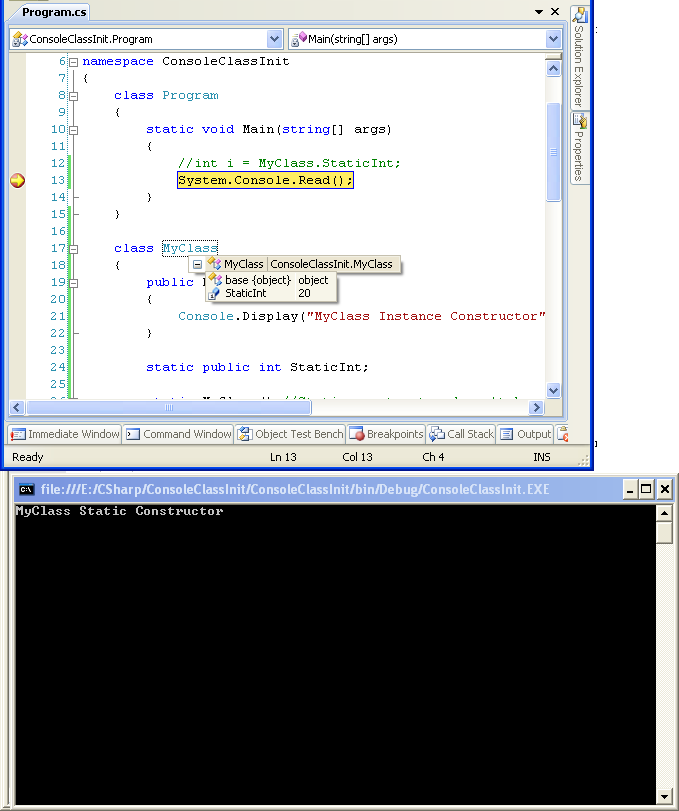
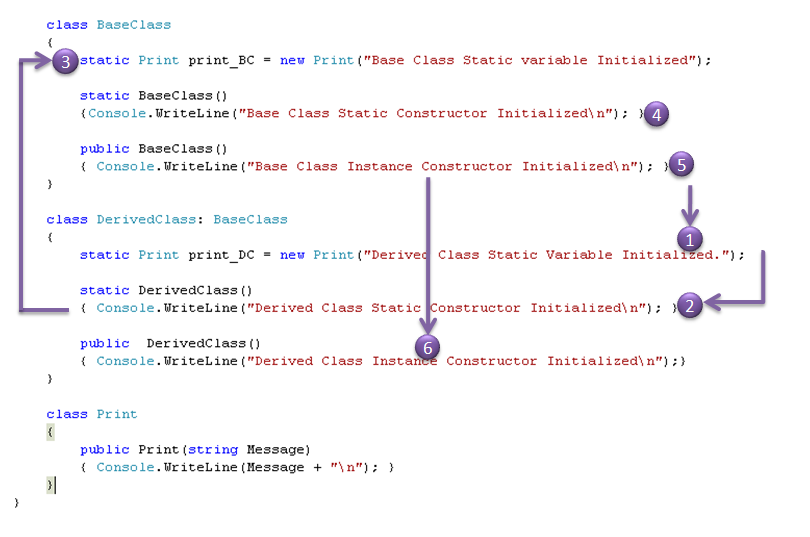

When Class is initialized in dot net?

 At compile time or when is class is accessed for the first time. To answer this question, I have a small snippet which I am playing around to understand “class initialization”.

Next question is, what is the order it follows. What are all properties are initialized first, static or instance properties. what happens when the instance of the derived class is created, which properties are initialized and what is the order.

Here I am trying to explore the initialization sequence.  
First, Lets look at when class is initialized, at compile time or when class is accessed for the first time.

```

namespace ConsoleClassInit
{
	class Program
	{
		static void Main(string[] args)
		{
			System.Console.Read();// Place a breakpoint here
		}
	}

	class MyClass
	{
		public MyClass()
		{
			Console.Display("MyClass Instance Constructor");
		}

		static MyClass() //Static constructor doesn't have access modifier and no arguments.
		{
			Console.Display("MyClass Static Constructor");
		}
	}

	static class Console
	{
		public static void Display(string message)
		{
			System.Console.WriteLine(message + "\n");
		}
	}
}
```

When I ran, I didn’t see any output, i.e, the class is not initialized during compilation time.

Now, Add a static field and in MyClass and try accessing it in Main.

```

namespace ConsoleClassInit
{
	class Program
	{
		static void Main(string[] args)
		{
			int i = MyClass.StaticInt;
			System.Console.Read();
		}
	}

	class MyClass
	{
		public MyClass()
		{
			Console.Display("MyClass Instance Constructor");
		}

		static public int StaticInt;

		static MyClass() //Static constructor doesn't have access modifier and no arguments.
		{
			StaticInt = 20;
			Console.Display("MyClass Static Constructor");
		}
	}

	static class Console
	{
		public static void Display(string message)
		{
			System.Console.WriteLine(message + "\n");
		}

	}
}
```

As expected, “int i = MyClass.StaticInt;” initialized MyClass and also “MyClass Static Constructor” message is displayed on Console and also Value of i in main is set to 20.

So Next is what? I will now comment the “int i = MyClass.StaticInt;” in Main. Let the breakpoint be there at System.Consol.Read(); and when I tried to enquire the value of MyClass in Debug mode, MyClass is initialized and “MyClass Static Constructor” message is displayed on the Console.

When I run the same code in release mode and debug mode without any breakpoint it didn’t show me the message or MyClass is not initialized. But when I tried to access MyClass at breakpoint, I received the message on the console.

[](https://harshaprojects.wordpress.com/wp-content/uploads/2010/04/classcompilationpng.png)

Class in Debug mode

Is it strange or when I tried to know the value of MyClass, that time class is access for the first time (Initialized) and message is pushed to console.

Here is the full version of the Class initialization. First take a look at the code:

```


namespace Console_ObjectInitialization
{
    class Program
    {
        static void Main(string[] args)
        {
            DerivedClass DC = new DerivedClass();
        }
    }

    class BaseClass
    {
        static Print print_BC = new Print("Base Class Static variable Initialized");

        static BaseClass()
        {Console.WriteLine("Base Class Static Constructor Initialized\n"); }

        public BaseClass()
        { Console.WriteLine("Base Class Instance Constructor Initialized\n"); }
    }

    class DerivedClass: BaseClass
    {
        static Print print_DC = new Print("Derived Class Static Variable Initialized.");

        static DerivedClass()
        { Console.WriteLine("Derived Class Static Constructor Initialized\n"); }

        public  DerivedClass()
        { Console.WriteLine("Derived Class Instance Constructor Initialized\n");}
    }

    class Print    {
        public Print(string Message)
        { Console.WriteLine(Message + "\n"); }
    }
}
```

Here is the sequece of the the class initialization.

[](https://harshaprojects.wordpress.com/wp-content/uploads/2010/05/initializationsequence1.png)

Class Initialization Sequence

Bill Wagner explain initialization of objects in much better way. Please follow the link for more information:

[Intialize Objects Properly](http://visualstudiomagazine.com/articles/2007/12/01/initialize-objects-properly.aspx)

Please comment on this. Let me know any results you have or any link related to this, please share.