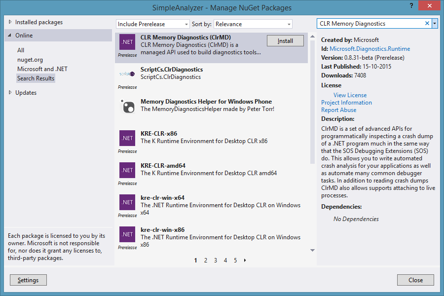
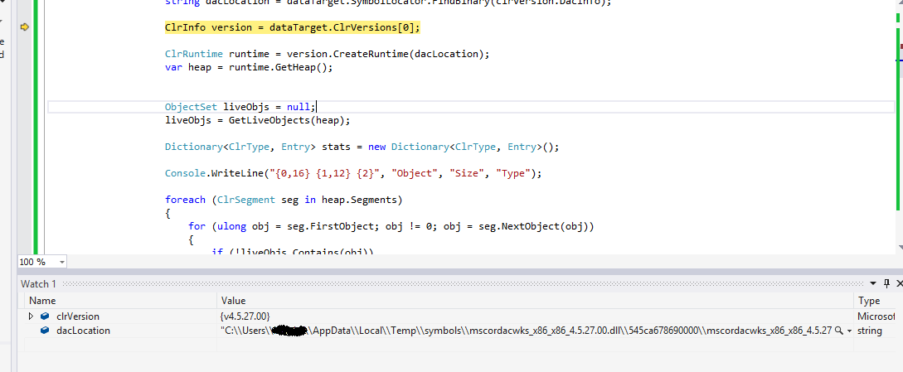

As we all know, there are many ways to analyze the application dump and also Live process. Most of us already using commercially available profilers for Live application analysis. We also have library (relatively new one ) [CLRMD](https://github.com/Microsoft/dotnetsamples/tree/master/Microsoft.Diagnostics.Runtime/CLRMD). Library is available with examples on GitHub.

Library is in Prerelease so when you adding thru the nuget manager please select Prerelease while searching.



NuGet Package

Once you have installed, lib can be used by adding following namespace:

```
 using Microsoft.Diagnostics.Runtime;
```

Important part is getting the heap.

```
 var process = Process.GetProcessesByName("ImageApplication").FirstOrDefault();  
       if (process != null)  
       {  
         int pid = process.Id;  
         const int timeout = 5000;  
         using (var dataTarget = DataTarget.AttachToProcess(pid, timeout))  
         {  
           var clrVersion = dataTarget.ClrVersions.FirstOrDefault();  
           string dacLocation = dataTarget.SymbolLocator.FindBinary(clrVersion.DacInfo);  
           ClrInfo version = dataTarget.ClrVersions[0];  
           ClrRuntime runtime = version.CreateRuntime(dacLocation);  
           var heap = runtime.GetHeap();  
         }
```



CLR Info, DAC and Heap

here is an example which pulls out all the objects a simple application(ImageApplication).

```
using System;
using System.Collections.Generic;
using System.Linq;
using System.Text;
using System.Threading.Tasks;
using Microsoft.Diagnostics.Runtime;
using System.Diagnostics;
using System.Collections;

namespace SimpleAnalyzer
{
    class Program
    {
        static void Main(string[] args)
        {

            var process = Process.GetProcessesByName("ImageApplication").FirstOrDefault();

            if (process != null)
            {
                int pid = process.Id;
                const int timeout = 5000;

                using (var dataTarget = DataTarget.AttachToProcess(pid, timeout))
                {
                    var clrVersion = dataTarget.ClrVersions.FirstOrDefault();
                  
                    string dacLocation = dataTarget.SymbolLocator.FindBinary(clrVersion.DacInfo);

                    ClrInfo version = dataTarget.ClrVersions[0];

                    ClrRuntime runtime = version.CreateRuntime(dacLocation);
                    var heap = runtime.GetHeap();

                
                    ObjectSet liveObjs = null;
                    liveObjs = GetLiveObjects(heap);

                    Dictionary<ClrType, Entry> stats = new Dictionary<ClrType, Entry>();

                    Console.WriteLine("{0,16} {1,12} {2}", "Object", "Size", "Type");

                    foreach (ClrSegment seg in heap.Segments)
                    {
                        for (ulong obj = seg.FirstObject; obj != 0; obj = seg.NextObject(obj))
                        {
                            if (!liveObjs.Contains(obj))
                                continue;

                            // This gets the type of the object.
                            ClrType type = heap.GetObjectType(obj);
                            ulong size = type.GetSize(obj);

                            Console.WriteLine("{0,16:X} {1,12:n0} {2}", obj, size, type.Name);

                            // Add an entry to the dictionary, if one doesn't already exist.
                            Entry entry = null;
                            if (!stats.TryGetValue(type, out entry))
                            {
                                entry = new Entry();
                                entry.Name = type.Name;
                                stats[type] = entry;
                            }

                            // Update the statistics for this object.
                            entry.Count++;
                            entry.Size += type.GetSize(obj);
                        }
                    }

                    // Now print out statistics.

                    Console.WriteLine("Stats");

                    // We'll actually let linq do the heavy lifting.
                    var sortedStats = from entry in stats.Values
                                      orderby entry.Size
                                      select entry;

                    ulong totalSize = 0, totalCount = 0;
                    Console.WriteLine("{0,12} {1,12} {2}", "Size", "Count", "Type");
                    foreach (var entry in sortedStats)
                    {
                        Console.WriteLine("{0,12:n0} {1,12:n0} {2}", entry.Size, entry.Count, entry.Name);
                        totalSize += entry.Size;
                        totalCount += (uint)entry.Count;
                    }

                    Console.WriteLine();
                    Console.WriteLine("Total: {0:n0} bytes in {1:n0} objects", totalSize, totalCount);
                }
            }
            else
                Console.WriteLine("Process not found!");

            Console.ReadLine();

        }
        private static ObjectSet GetLiveObjects(ClrHeap heap)
        {
            ObjectSet considered = new ObjectSet(heap);
            Stack<ulong> eval = new Stack<ulong>();

            foreach (var root in heap.EnumerateRoots())
                eval.Push(root.Object);

            while (eval.Count > 0)
            {
                ulong obj = eval.Pop();
                if (considered.Contains(obj))
                    continue;

                considered.Add(obj);

                var type = heap.GetObjectType(obj);
                if (type == null)  // Only if heap corruption
                    continue;

                type.EnumerateRefsOfObject(obj, delegate(ulong child, int offset)
                {
                    if (child != 0 && !considered.Contains(child))
                        eval.Push(child);
                });
            }

            return considered;
        }

    }
    
    class DumpDiffEntry
    {
        public ClrType Type;
        public int Count;
        public long Size;
    }

    class Entry
    {
        public string Name;
        public int Count;
        public ulong Size;
    }
    class ObjectSet
    {
        struct Entry
        {
            public ulong High;
            public ulong Low;
            public int Index;
        }

        public ObjectSet(ClrHeap heap)
        {
            m_shift = IntPtr.Size == 4 ? 3 : 4;
            int count = heap.Segments.Count;

            m_data = new BitArray[count];
            m_entries = new Entry[count];
#if DEBUG
            ulong last = 0;
#endif

            for (int i = 0; i < count; ++i)
            {
                var seg = heap.Segments[i];
#if DEBUG
                Debug.Assert(last < seg.Start);
                last = seg.Start;
#endif

                m_data[i] = new BitArray(GetBitOffset(seg.Length));
                m_entries[i].Low = seg.Start;
                m_entries[i].High = seg.End;
                m_entries[i].Index = i;
            }
        }

        public void Add(ulong value)
        {
            if (value == 0)
            {
                m_zero = true;
                return;
            }

            int index = GetIndex(value);
            if (index == -1)
                return;

            int offset = GetBitOffset(value - m_entries[index].Low);

            m_data[index].Set(offset, true);
        }

        public bool Contains(ulong value)
        {
            if (value == 0)
                return m_zero;

            int index = GetIndex(value);
            if (index == -1)
                return false;

            int offset = GetBitOffset(value - m_entries[index].Low);

            return m_data[index][offset];
        }

        public int Count
        {
            get
            {
                // todo, this is nasty.
                int count = 0;
                foreach (var set in m_data)
                    foreach (bool bit in set)
                        if (bit) count++;

                return count;
            }
        }

        private int GetBitOffset(ulong offset)
        {
            Debug.Assert(offset < int.MaxValue);
            return GetBitOffset((int)offset);
        }

        private int GetBitOffset(int offset)
        {
            return offset >> m_shift;
        }

        private int GetIndex(ulong value)
        {
            int low = 0;
            int high = m_entries.Length - 1;

            while (low <= high)
            {
                int mid = (low + high) >> 1;
                if (value < m_entries[mid].Low)
                    high = mid - 1;
                else if (value > m_entries[mid].High)
                    low = mid + 1;
                else
                    return mid;
            }

            // Outside of the heap.
            return -1;
        }

        BitArray[] m_data;
        Entry[] m_entries;
        int m_shift;
        bool m_zero;
    }

}
```

Out Put is

```
          Object         Size Type
         26F1024           84 System.Exception
         26F1078           84 System.OutOfMemoryException
         26F10CC           84 System.StackOverflowException
         26F1120           84 System.ExecutionEngineException
         26F1174           84 System.Threading.ThreadAbortException
         26F11C8           84 System.Threading.ThreadAbortException
         26F121C           12 System.Object
         26F1228           14 System.String
         26F1238           28 System.SharedStatics
         26F1254          152 System.String
         26F12EC          206 System.String
         26F13BC          112 System.AppDomain
         26F142C           22 System.String
         26F1444           78 System.String
         26F1494           68 System.AppDomainSetup
         26F1598           28 System.String
         26F15C4           54 System.String
         26F15FC           88 System.String[]
         26F1730           28 System.String
         26F174C           16 System.String
         26F175C           38 System.String
         26F1784           44 System.String
         26F17B0           46 System.String
         26F17E0           34 System.String
         26F1804           28 System.String
         26F1820           30 System.String
         26F1840           38 System.String
         26F1868           58 System.String
         26F18A4           58 System.String
         26F18E0           64 System.String
         26F1920           52 System.String
         26F1954           50 System.String
         26F1988           44 System.String
         26F19B4           44 System.String
         26F19E0           30 System.String
         26F1A00           42 System.String
         26F1A2C           56 System.String
         26F1A64           36 System.String
         26F1A88           24 System.String
         26F1BA0           78 System.String
         26F1BF0           70 System.String
         26F1C38           82 System.String
         26F1C8C           36 System.Security.PermissionSet
         26F1CB0           20 Microsoft.Win32.SafeHandles.SafePEFileHandle
         26F1CC4           32 System.Security.Policy.PEFileEvidenceFactory
         26F1CE4           40 System.Security.Policy.Evidence
         26F1D0C           48 System.Collections.Generic.Dictionary<System.Type,System.Security.Policy.EvidenceTypeDescriptor>
         26F1D3C           28 System.RuntimeType
         26F1D58           28 System.RuntimeType
         26F1D74           28 System.RuntimeType
         26F1D90           28 System.RuntimeType
         26F1DAC           28 System.RuntimeType
         26F1DC8           28 System.RuntimeType
         26F1DE4           28 System.RuntimeType
         26F1E00           28 System.RuntimeType
         26F1E1C           28 System.RuntimeType
         26F1E38           28 System.RuntimeType
         26F1E54           12 System.Collections.Generic.ObjectEqualityComparer<System.Type>
         26F1E60           56 System.Type[]
         26F1E98           28 System.RuntimeType
         26F1EB4           28 System.RuntimeType
         26F1ED0           28 System.RuntimeType
         26F1EEC           28 System.RuntimeType
         26F1F08           28 System.RuntimeType
         26F1F24           28 System.RuntimeType
         26F1F40           28 System.RuntimeType
         26F1F5C           28 System.RuntimeType
         26F1F78           28 System.RuntimeType
         26F1F94           28 System.RuntimeType
         26F1FB0          300 System.Int32[]
         26F20DC           12 System.Object
         26F21E0           80 System.Int32[]
         26F2230          284 System.Collections.Generic.Dictionary+Entry<System.Type,System.Security.Policy.EvidenceTypeDescriptor>[]
         26F234C           44 System.Threading.ReaderWriterLock
         26F2378           28 System.Reflection.RuntimeAssembly
         26F2394           16 System.Security.Policy.AssemblyEvidenceFactory
         26F23C0           16 System.String[]
         26F23D0           58 System.String
         26F240C           60 System.String
         26F2448           50 System.String
         26F247C           12 ImageApplication.CustomImage
         26F2488           86 System.String
         26F24E0           84 System.Char[]
         26F2534           28 System.Char[]
         26F2550           84 System.Char[]
         26F25A4           88 System.Char[]
         26F25FC           94 System.Char[]
         26F265C           76 System.Char[]
         26F26A8           24 System.String
         26F26C0           24 System.String
         26F26D8           42 System.String
         26F27C0           16 System.Object[]
         26F27D0           14 System.Char[]
         26F27E0           14 System.Char[]
         26F27F0           16 System.String
         26F2888           12 System.Security.Permissions.SecurityPermission
         26F2894           36 System.Security.Util.TokenBasedSet
         26F28B8           32 System.Security.PermissionTokenFactory
         26F28D8           84 System.Security.PermissionToken[]
         26F292C           52 System.Collections.Hashtable
         26F2960           96 System.Collections.Hashtable+bucket[]
         26F29C0           52 System.Collections.Hashtable
         26F29F4           96 System.Collections.Hashtable+bucket[]
         26F2A54           20 System.Security.PermissionToken
         26F2A88           28 System.RuntimeType
         26F2ACC           28 System.RuntimeType
         26F2B00           24 System.OperatingSystem
         26F2B18           24 System.Version
         26F2B30           24 System.Version
         26F2C8C           56 System.String
         26F2CC4           92 System.String
         26F2D20           44 System.Diagnostics.TraceSwitch
         26F2D4C           16 System.String
         26F2D5C           24 System.Collections.Generic.List<System.WeakReference>
         26F2D74           16 System.WeakReference[]
         26F2D84           12 System.WeakReference
         26F2D90           32 System.WeakReference[]
         26F2DB0           32 System.EventHandler
         26F2DD0           24 System.Drawing.Bitmap
         26F2E00           90 System.String
         26F2E5C           90 System.String
         26F2EB8           90 System.String
         26F2F14           90 System.String
         26F2F70           90 System.String
         26F2FCC           90 System.String
         26F3028           90 System.String
         26F3084           90 System.String
         26F30E0           90 System.String
         26F313C           90 System.String
         26F3198           90 System.String
         26F31F4           90 System.String
         26F3250           24 System.Guid
         26F3268           60 System.String
         26F32A4           48 System.String
         26F32D4           48 System.String
         26F3304           58 System.String
         26F3340           24 System.Drawing.Imaging.ImageFormat
         26F3358           24 System.Drawing.Imaging.ImageFormat
         26F3370           24 System.Drawing.Imaging.ImageFormat
         26F3388           24 System.Drawing.Imaging.ImageFormat
         26F33A0           24 System.Drawing.Imaging.ImageFormat
         26F33B8           24 System.Drawing.Imaging.ImageFormat
         26F33D0           24 System.Drawing.Imaging.ImageFormat
         26F33E8           24 System.Drawing.Imaging.ImageFormat
         26F3400           24 System.Drawing.Imaging.ImageFormat
         26F3418           24 System.Drawing.Imaging.ImageFormat
         26F3430           24 System.Drawing.Imaging.ImageFormat
         26F3448           24 System.Drawing.Imaging.ImageFormat
         26F3460           28 Microsoft.Win32.Win32Native+InputRecord
         26F347C           32 System.Text.UnicodeEncoding
         26F349C           16 System.String
         26F34AC           16 System.Text.EncoderReplacementFallback
         26F34BC           16 System.Text.DecoderReplacementFallback
         26F34CC           12 System.Object
         26F34D8           20 Microsoft.Win32.SafeHandles.SafeFileHandle
         26F34EC           12 System.Object
         26F34F8           12 System.Object
         26F3504           52 System.Collections.Hashtable
         26F3538           48 System.Collections.Hashtable+bucket[]
         26F3574           40 System.String
         26F359C           28 System.RuntimeType
         26F35B8           28 System.Reflection.RuntimeAssembly
         26F361C           30 System.String
         26F363C           26 System.String
         26F3658           72 System.Text.SBCSCodePageEncoding
         26F36A0           20 System.Text.InternalEncoderBestFitFallback
         26F36B4           24 System.Text.InternalDecoderBestFitFallback
         26F36CC           78 System.String
         26F371C           72 System.Globalization.CultureInfo
         26F3764           16 System.String
         26F3774           16 System.String
         26F3784           16 System.String
         26F3794           16 System.String
         26F37A4           90 System.String
         26F3800           18 System.String
         26F3814           50 System.String
         26F3848           18 System.String
         26F385C           48 System.String
         26F388C           16 System.String
         26F389C           16 System.String
         26F38AC           16 System.String
         26F38BC           16 System.String
         26F38CC           16 System.String
         26F38DC           16 System.String
         26F38EC           16 System.String
         26F38FC           16 System.String
         26F390C           16 System.String
         26F391C           16 System.String
         26F392C           20 System.String
         26F3940           30 System.String
         26F3960           32 System.String
         26F3980           16 System.String
         26F3990           16 System.String
         26F39A0           20 System.String
         26F39B4           68 System.String
         26F39F8           18 System.String
         26F3A0C           18 System.String
         26F3A20           30 System.String
         26F3A40           24 System.String
         26F3A58           30 System.String
         26F3A78           22 System.String
         26F3A90           28 System.String
         26F3AAC           24 System.String
         26F3AC4           20 System.String
         26F3AD8           20 System.String
         26F3AEC           20 System.String
         26F3B00           20 System.String
         26F3B14           40 System.String
         26F3B3C          114 System.String
         26F3BB0           24 System.Version
         26F3BC8          308 System.Globalization.CultureData
         26F3CFC           56 System.String[]
         26F3D34           16 System.Int32[]
         26F3D44           16 System.Int32[]
         26F3D54           20 System.String[]
         26F3D68           32 System.String[]
         26F3D88           20 System.String[]
         26F3D9C           16 System.Int32[]
         26F3DAC          108 System.Globalization.CalendarData[]
         26F3E18           50 System.String
         26F3E4C           34 System.String
         26F3E70           34 System.String
         26F3E94           50 System.String
         26F3EC8           32 System.String
         26F3EE8           28 System.String
         26F3F04           22 System.String
         26F3F1C           18 System.String
         26F3F30           26 System.String
         26F3F4C           26 System.String
         26F3F68           28 System.String
         26F3F84           32 System.String
         26F3FA4           30 System.String
         26F3FC4           26 System.String
         26F3FE0           30 System.String
         26F4000           20 System.String
         26F4014           20 System.String
         26F4028           20 System.String
         26F403C           20 System.String
         26F4050           20 System.String
         26F4064           20 System.String
         26F4078           20 System.String
         26F408C           18 System.String
         26F40A0           18 System.String
         26F40B4           18 System.String
         26F40C8           18 System.String
         26F40DC           18 System.String
         26F40F0           18 System.String
         26F4104           18 System.String
         26F4118           28 System.String
         26F4134           30 System.String
         26F4154           24 System.String
         26F416C           24 System.String
         26F4184           20 System.String
         26F4198           22 System.String
         26F41B0           22 System.String
         26F41C8           26 System.String
         26F41E4           32 System.String
         26F4204           28 System.String
         26F4220           30 System.String
         26F4240           30 System.String
         26F4260           20 System.String
         26F4274           20 System.String
         26F4288           20 System.String
         26F429C           20 System.String
         26F42B0           20 System.String
         26F42C4           20 System.String
         26F42D8           20 System.String
         26F42EC           20 System.String
         26F4300           20 System.String
         26F4314           20 System.String
         26F4328           20 System.String
         26F433C           84 System.Globalization.CalendarData
         26F4390           24 System.String[]
         26F43A8           20 System.String[]
         26F43BC           20 System.String[]
         26F43D0           20 System.String[]
         26F43E4           20 System.String[]
         26F43F8           20 System.String[]
         26F440C           44 System.String[]
         26F4438           44 System.String[]
         26F4464           44 System.String[]
         26F4490           68 System.String[]
         26F44D4           68 System.String[]
         26F4518           26 System.String
         26F4534           26 System.String
         26F4568           72 System.Globalization.CultureInfo
         26F45E4           24 System.String
         26F45FC           48 System.Collections.Generic.Dictionary<System.String,System.Globalization.CultureData>
         26F462C           28 System.RuntimeType
         26F4648           28 System.RuntimeType
         26F4664           12 System.Collections.Generic.GenericEqualityComparer<System.String>
         26F4670          308 System.Globalization.CultureData
         26F47A4           24 System.String
         26F47BC           24 System.String
         26F47D4           24 System.String
         26F47EC           24 System.String
         26F4804           24 System.String
         26F4834           12 System.Object
         26F4840           24 System.Int32[]
         26F4858           60 System.Collections.Generic.Dictionary+Entry<System.String,System.Globalization.CultureData>[]
         26F48AC           72 System.Globalization.CultureInfo
         26F4928           24 System.String
         26F4940          308 System.Globalization.CultureData
         26F4A74           24 System.String
         26F4A8C           24 System.String
         26F4AA4           24 System.String
         26F4ABC           24 System.String
         26F4B34           22 System.String
         26F4B4C           26 System.String
         26F4B68           52 System.Object[]
         26F4B9C           28 System.Text.StringBuilder
         26F4BB8          156 System.Char[]
         26F4C54           28 System.RuntimeType
         26F4C70           28 System.RuntimeType
         26F4C8C           28 System.RuntimeType
         26F4CA8          132 System.Globalization.NumberFormatInfo
         26F4D94           16 System.String
         26F4E38           20 Microsoft.Win32.SafeHandles.SafeViewOfFileHandle
         26F4E4C           20 Microsoft.Win32.SafeHandles.SafeFileMappingHandle
         26F4E60           12 System.Int32
         26F4E6C           28 System.IO.__ConsoleStream
         26F4E88           20 System.IO.Stream+NullStream
         26F4E9C           60 System.IO.StreamWriter
         26F4ED8           30 System.String
         26F4EF8           26 System.String
         26F4F14           16 System.Char[]
         26F4F24           28 System.Text.EncoderNLS
         26F4F40          524 System.Char[]
         26F514C          269 System.Byte[]
         26F525C           24 System.String
         26F5274           24 System.String
         26F528C           32 System.String
         26F52AC           32 System.String
         26F52CC           32 System.String
         26F52EC           24 System.IO.TextWriter+SyncTextWriter
         26F5304           52 System.Threading.Thread
         26F5338           16 System.Char[]
         26F5384           24 System.String
         26F539C           26 System.String
         26F53B8           20 Microsoft.Win32.SafeHandles.SafeFileHandle
         26F53D8           28 System.IO.__ConsoleStream
         26F53F4           64 System.IO.StreamReader
         26F5434           28 System.Text.DecoderNLS
         26F5450          268 System.Byte[]
         26F555C          524 System.Char[]
         26F5768           12 System.Byte[]
         26F5774           16 System.IO.TextReader+SyncTextReader
         36F1020        4,456 System.Object[]
         36F2198          528 System.Object[]
         36F23B8        4,096 System.Object[]
         36F33C8        8,176 System.Object[]
Stats
        Size        Count Type
          12            1 System.Collections.Generic.ObjectEqualityComparer<System.Type>
          12            1 ImageApplication.CustomImage
          12            1 System.Security.Permissions.SecurityPermission
          12            1 System.WeakReference
          12            1 System.Collections.Generic.GenericEqualityComparer<System.String>
          12            1 System.Int32
          16            1 System.Security.Policy.AssemblyEvidenceFactory
          16            1 System.Text.EncoderReplacementFallback
          16            1 System.Text.DecoderReplacementFallback
          16            1 System.IO.TextReader+SyncTextReader
          20            1 Microsoft.Win32.SafeHandles.SafePEFileHandle
          20            1 System.Security.PermissionToken
          20            1 System.Text.InternalEncoderBestFitFallback
          20            1 Microsoft.Win32.SafeHandles.SafeViewOfFileHandle
          20            1 Microsoft.Win32.SafeHandles.SafeFileMappingHandle
          20            1 System.IO.Stream+NullStream
          24            1 System.OperatingSystem
          24            1 System.Collections.Generic.List<System.WeakReference>
          24            1 System.Drawing.Bitmap
          24            1 System.Guid
          24            1 System.Text.InternalDecoderBestFitFallback
          24            1 System.IO.TextWriter+SyncTextWriter
          28            1 System.SharedStatics
          28            1 Microsoft.Win32.Win32Native+InputRecord
          28            1 System.Text.StringBuilder
          28            1 System.Text.EncoderNLS
          28            1 System.Text.DecoderNLS
          32            1 System.Security.Policy.PEFileEvidenceFactory
          32            1 System.Security.PermissionTokenFactory
          32            1 System.EventHandler
          32            1 System.Text.UnicodeEncoding
          36            1 System.Security.PermissionSet
          36            1 System.Security.Util.TokenBasedSet
          40            1 System.Security.Policy.Evidence
          40            2 Microsoft.Win32.SafeHandles.SafeFileHandle
          44            1 System.Threading.ReaderWriterLock
          44            1 System.Diagnostics.TraceSwitch
          48            1 System.Collections.Generic.Dictionary<System.Type,System.Security.Policy.EvidenceTypeDescriptor>
          48            2 System.WeakReference[]
          48            1 System.Collections.Generic.Dictionary<System.String,System.Globalization.CultureData>
          52            1 System.Threading.Thread
          56            1 System.Type[]
          56            2 System.Reflection.RuntimeAssembly
          56            2 System.IO.__ConsoleStream
          60            1 System.Collections.Generic.Dictionary+Entry<System.String,System.Globalization.CultureData>[]
          60            1 System.IO.StreamWriter
          64            1 System.IO.StreamReader
          68            1 System.AppDomainSetup
          72            6 System.Object
          72            3 System.Version
          72            1 System.Text.SBCSCodePageEncoding
          84            1 System.Exception
          84            1 System.OutOfMemoryException
          84            1 System.StackOverflowException
          84            1 System.ExecutionEngineException
          84            1 System.Security.PermissionToken[]
          84            1 System.Globalization.CalendarData
         108            1 System.Globalization.CalendarData[]
         112            1 System.AppDomain
         132            1 System.Globalization.NumberFormatInfo
         156            3 System.Collections.Hashtable
         168            2 System.Threading.ThreadAbortException
         216            3 System.Globalization.CultureInfo
         240            3 System.Collections.Hashtable+bucket[]
         284            1 System.Collections.Generic.Dictionary+Entry<System.Type,System.Security.Policy.EvidenceTypeDescriptor>[]
         288           12 System.Drawing.Imaging.ImageFormat
         452            6 System.Int32[]
         549            3 System.Byte[]
         624           17 System.String[]
         784           28 System.RuntimeType
         924            3 System.Globalization.CultureData
       1,718           13 System.Char[]
       6,628          180 System.String
      17,324            6 System.Object[]

Total: 32,951 bytes in 351 objects
```

Following blog from where I started reading about CLRMD

<http://gigi.nullneuron.net/gigilabs/analyzing-live-process-memory-with-clrmd/#comment-8857>

***Many thanks to gigi labs for posting and updating the code.***

***For More info and good part of example code in this Blog  is taken from CLRMD examples, please visit:***

<https://github.com/Microsoft/dotnetsamples/tree/master/Microsoft.Diagnostics.Runtime/CLRMD>