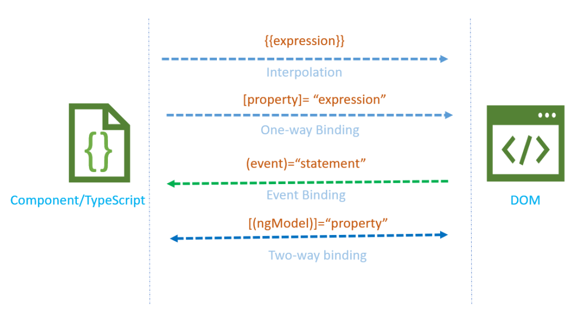

##### Angular#8

* [](https://harshaprojects.wordpress.com/wp-content/uploads/2021/10/databindingangular-3.png?w=1024)

Similar to WPF in Angular we have Data Binding and about picture is shows, 4 types. Interpolation, property Binding, Event Binding and Two-way binding.

```
import { Component, OnInit } from '@angular/core';

@Component({
  selector: 'app-data-binding',
  //templateUrl: './data-binding.component.html',
  template:`
      <div>
          <p>we are getting value through Interpolation. Local time is is {{localTime}}</p>
      </div>
      <div>
          <button (click)="togglePara()">show or Hide Paragraph</button>
      </div>
      <div>
      <p>show para boolean value:{{showPara}}</p>
      <p [hidden]=!showPara >
          This Paragraph element is visible or hidden based on the "showPara" boolean
      </p>
      </div>
      <div>
       <p>Two way biding using ngModel</p>
       <p>Enter text:</p>
       <input type="text" [(ngModel)]="textValue">
       <p>{{textValue}}</p>
      </div>`,
  styleUrls: ['./data-binding.component.css']
})
export class DataBindingComponent implements OnInit {

  localTime:string|undefined;
  showPara:boolean =true;
  textValue:string|undefined;

  constructor() { 
    this.getTime();
  }

  getTime(){
    this.localTime= new Date().toLocaleString();
  }

  togglePara(){
    this.showPara =!this.showPara;
  }

  ngOnInit(): void {
  }
}
```

ngModel requires FormsModule, so make sure that you import it in app.module.ts