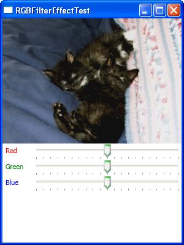

I have been working on image display using WPF.  After searching for a week, I found good examples. Here is the small list of examples with link.

1. Custom BitmapEffect Sample – RGBFilter.

The sample project from Microsoft is a nice example for image display. The Solution contains 3 project. First ATL COM dll project, where author creates and change the bitmap. Second, Wrapper for this COM DLL. Third, WPF Project. WPF Project is just a UI. But the problem is, COM DLL require registration.

Customer Bitmap Effect Sample

<http://msdn.microsoft.com/en-us/library/ms771475(VS.90).aspx>

2. Revised BitmapEffect Sample Without DLL Registration.

I found one more example where DLL registration is solved.  Example looks same as MSDN example, but it is slightly different from the MSDN. So visit the link to download the example.

<http://johnmelville.spaces.live.com/cns!79D76793F7B6D5AD!115.entry>

3.  Using WIC native APIs.

Author digs into *BitmapSource* and found that *BitmapSource* calls WIC native API’s for handling its buffer internally. So he build his own DLL and consumed in the WPF Application.

<http://blogs.microsoft.co.il/blogs/tomershamam/archive/2007/09/21/wpf-image-processing.aspx>

But there is one problem with example number 3. Image.Invalidatevisual is very slow(ofcourse author mentioned it).

Method 1 and 2 i.e., Bitmap effect sample, I guess they are getting performance because they uses display data inside, please correct me if I am wrong.

So, my search is on for finding best method or technology for displaying image. If you come across anything, please let me know.

Thanks for your time and thanks for visiting the blog.

-Harsha