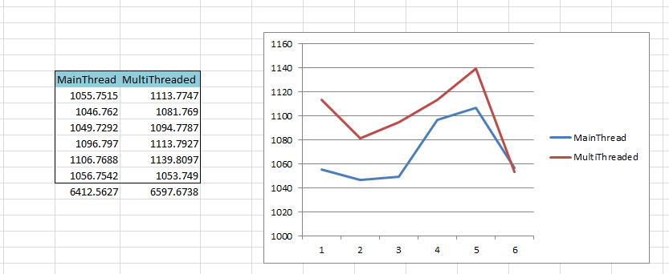

Yesterday, In one of the discussion, there was an interesting question about threading.

*What is the expected result if you have multiple thread running and each creates a new object but when these threads go through a critical section which is locked by a static object.* As we all know it will take more time because of the static object used for synchronization. And its time would be more than if application runs without creating threads.

I was curious to see how much would be the difference –Time Difference.

First let me share my code:

```
namespace ThreadingCriticalSection
{
    class Program
    {
        static void Main(string[] args)
        {
            Console.WriteLine("Main thread");

            for (int i = 0; i &lt;= 5; i++)
            {
                new ClassWithCriticalSection().LetsProcess();
            }

            Console.WriteLine("With 6 Thread");
            for (int i = 0; i &lt;= 5; i++)
            {
                System.Threading.ThreadStart start = new System.Threading.ThreadStart(new ClassWithCriticalSection().LetsProcessWithThread);
                System.Threading.Thread th = new System.Threading.Thread(start);
                th.Start();
            }
            int j = 0;
            j++;           

        }
    }

    class ClassWithCriticalSection
    {
        public static object LockingObject = new object();

        public void LetsProcessWithThread()
        {
            lock (LockingObject)
            {
                LetsProcess();
            }
        }

        public void LetsProcess()
        {
            var entryTime = DateTime.Now;
            FindPrimeNumber(100000);
            var exitTime = DateTime.Now;
            var diff = exitTime.Subtract(entryTime).TotalMilliseconds;
            Console.WriteLine("Thread ID:{0}; {1},", System.Threading.Thread.CurrentThread.ManagedThreadId,diff.ToString());
        }

        public long FindPrimeNumber(int n)
        {

            int count = 0;
            long a = 2;
            while (count &lt; n)
            {
                long b = 2;
                int prime = 1;// to check if found a prime
                while (b * b &lt;= a)                 {                     if (a % b == 0)                     {                         prime = 0;                         break;                     }                     b++;                 }                 if (prime &gt; 0)
                {
                    count++;
                }
                a++;
            }
            return (--a);
        }
    }
```

As you see, first I am trying to run the code 6 times without any threads and then I have created 6 threads which will go through the same code as before but with addition to locking code.

and final result:



Time in Milliseconds. Time taken for calculation by main thread is little less compared time taken by threads.

So final question? how slow. In this case its 185.1111 Milliseconds. So lets do some math here:

when using Main thread, for an average processing time of 1066 millisecond, multi thread(6) might take 1099 milliseconds when static object is used for synchronization.

I have used the FindPrimenumber method from the the following  url and answered by [Parag Meshram](http://stackoverflow.com/users/158207/parag-meshram):

<http://stackoverflow.com/questions/13001578/i-need-a-slow-c-sharp-function>

Let me know your thoughts. Thanks for visiting my blog.