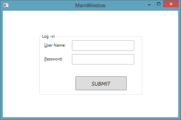

I have added a MVVM Example in GitHub:

<https://github.com/HarshaProjects/LoginScreen>

This simple project is an implementation of Log-in Screen in WPF using MVVM pattern.

Please leave your comments.