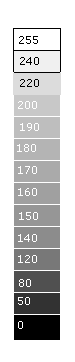
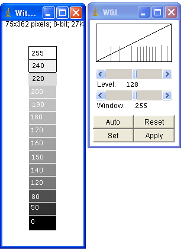
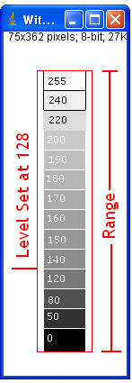
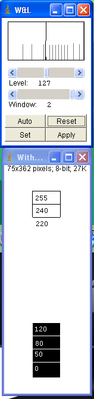
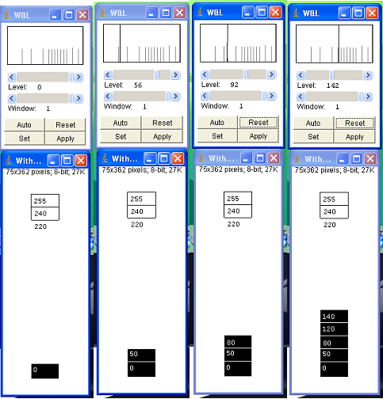

In any standard image processing application, we have something called Window Level.  On the net for Window Level, I didn’t get any convincing explanation. Except for one site.  Here I am trying to share my understanding of Window Level.

What is Window and What is Level?  
Level designates the **center of the range of values** mapped to grayscale. Window designates the **extent of the range of either side of the level**.  
So range mapped is (level – window/2) to (level +Window/2).  
For positive Window value, region less than (level-window/2) are clamped to black and regions greater than (level + Window/2) are clamped to white.  
Here is an Image with filled with gray scale values ranging from 0 to 255.  
[Source: http://www.vtk.org/pipermail/vtkusers/2002-October/063541.html](http://www.vtk.org/pipermail/vtkusers/2002-October/063541.html)

To begin with, I created an image, painted with stepped gray scale values from 0 to 255. As shown in the figure. The grayscale values are printed inside the rectangles. I deliberately put the black outline around the boxes labeled 240 and 255 since they merge with the background of the image. So our test image is ready.

I used the popular image application, ImageJ for this experiment.

When you open the image using ImageJ, and look at the Window Level Window, this is what you find.

Test Image Opened in ImageJ

Here Level is ‘128’ that is midway between 0 and 255 of the 8 bit gray scale image; and Window is 255. So our range becomes

Lower Value of the Range = (level – window/2)

                = 128 – 255/2

                = 0.5.  i.e., 1

And Upper Value of the Range   = (level + Window/2) = 128 + 255/2 = 255.5 =~ 255.

So all pixels values in the range 0 to 255 are visible.

Window & Level

So, looking closer at  Window and Level: From the Image, Level is 128 and Range is 255. That is in a given 8 bit gray scale image, every gray scale will be visible.

**What happens if we set Level to 127 with Window to 2?**

Since the range is very small. We will see only pixel values between 126 to 128. Boxes which are painted with gray scan value less than 126 are all turned to **BLACK** and Boxes above 128 are all turned to **WHITE**.

Level - 127 Window 2

When you set Level 0 and Window 1, you can see only one box which painted Black(Grey scan value 0). Take a look at these Images, as the with Window set to 1 and level start moving up from 0 to 100, All boxes will start showing up as BLACK in color since window set to 1.

At Level 142 and Window 1, it will display all boxes which are painted with less than 142 shows as BLACK and above 142 are all set to WHITE.

One can consider ‘Window’ as  Diameter of the circle and ‘Level’ as the center of the circle. More the diameter more the range, i.e, more boxes are visible or pixel with more gray scale values will be visible.

 

At Different Level and Window

Hope the article helped you understand the window and level. Thanks for reading the article. Feel free to comment.