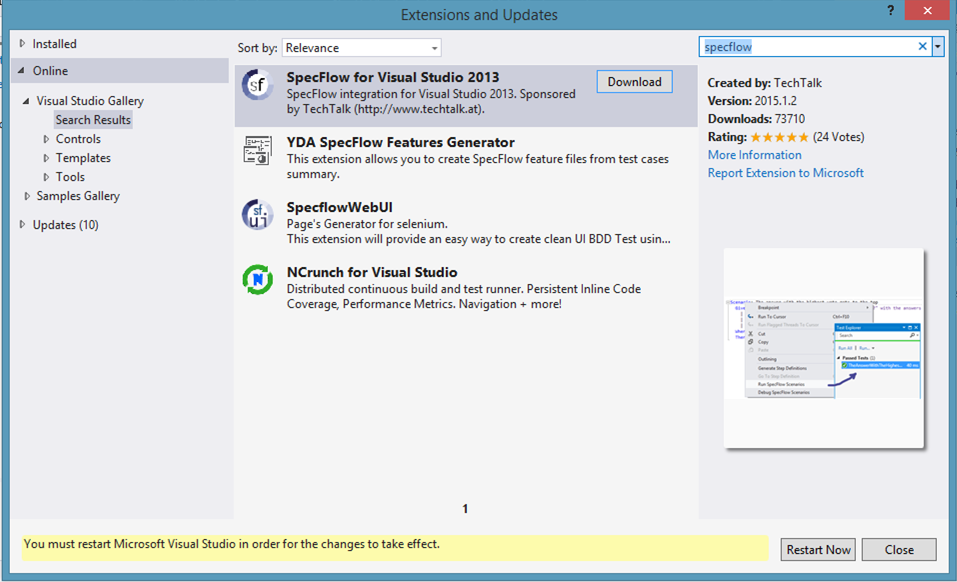
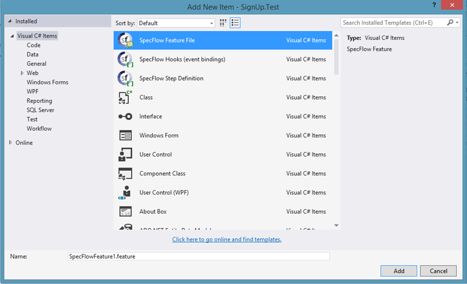
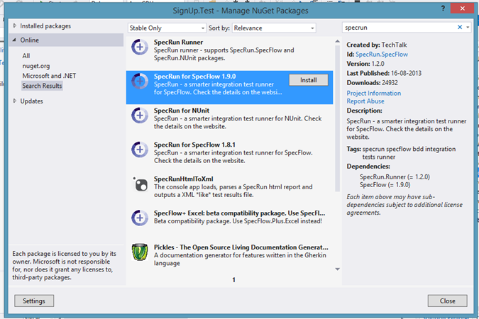
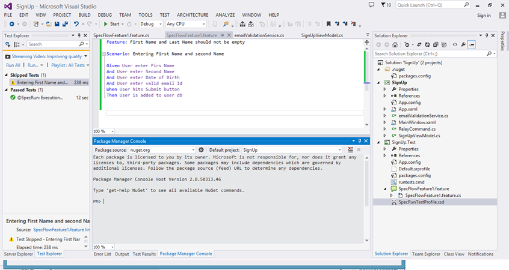
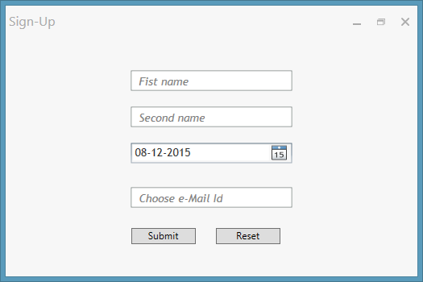
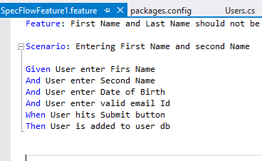
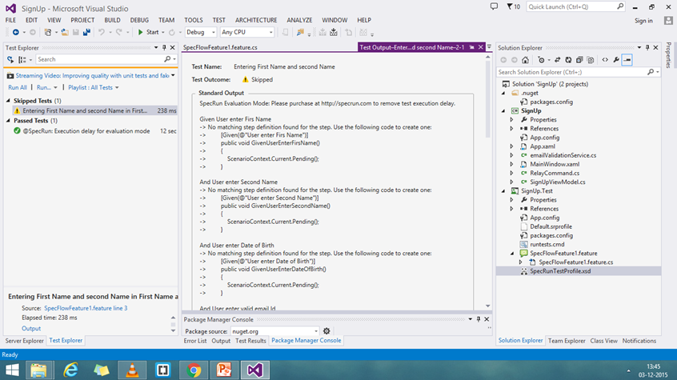
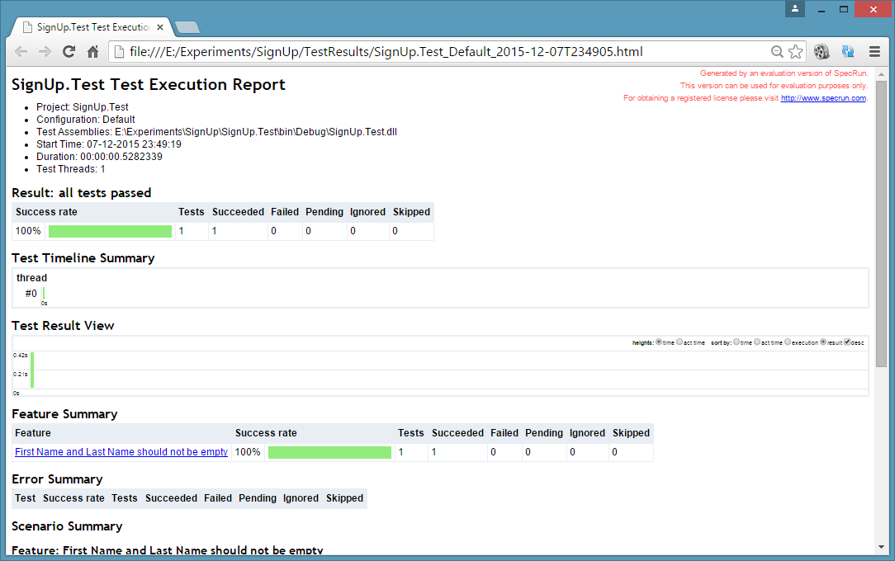

Here I am documenting BDD and This experiment is more like setting up BDD using SpecFlow in Visual Studio 2013. One should be able to set up BDD in 15Mins.

Important links on BDD:

1. [From Wiki](https://en.wikipedia.org/wiki/Behavior-driven_development)
2. [Dan North](http://dannorth.net/introducing-bdd/)

So lets Set up the SpecFlow(<http://www.specflow.org/getting-started/>)

First search for SpecFlow in VS2013

Search for SpecFlow

2. Add a Unit testing Project and Add Feature File to project

Add Feature file to unit test project

3. Spec runner is require to run the BDD. By Default, Speeflow is configured to run using nUnit.

Add Spec Runner to test project

4. Probably you don’t need this step.

Another way to add is from Nuget manager’s console

5. Now we are all Set. I have a small application called Sign up, where user enters first name, second name, Date of Birth and also email id. If user is more than 18 years and chosen email id is not found in our DB, user is allowed to sign up. Of-course, first and second name should not be empty. In-fact, this is our condition and business requirement.

Sign up Application

6. Open the Spec flow Feature file and add your business requirement:

First Business requirement

7.  Now run all test… Because we don’t have any test written, spec flow give you a suggestion:

Suggestion From SpecFlow

8. Copy this code to a new class file in the same project and add your Test cases and Run it.  In this project it is more like setting the Spec flow for BDD. I had a application for which I want to write the Test cases. In BDD, We write the Business requirement and then you write the logic and this logic may be in more than one class or more than one module. At the same time you have TDD, Where you will writing small test which covers piece of code for various scenarios.

Best part of BDD is the report, your business or product owner can always see the progress of the work.

Spec Flow Report

Thanks for going thru the blog.

Link to complete project:[Signup on OneDrive](http://1drv.ms/1XXOPTJ)